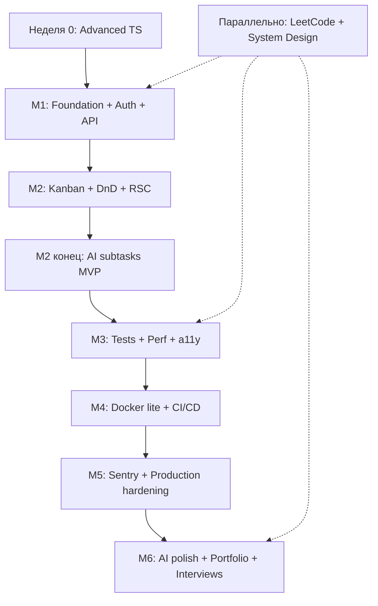

# Nexus — Финальный план обучения 10/10

**Профиль:** Middle Frontend (React + TS) → Strong Middle / Full-stack Frontend  
**Срок:** 7 месяцев (10–15 ч/нед при full-time работе)  
**Дополнительно:** [roadmap.sh/frontend](https://roadmap.sh/frontend) + LeetCode (50–100 задач)  
**Правило shipping:** каждый месяц — живой deploy с новой видимой фичей

---

## Цели и критерии успеха

| Цель                 | Как измеряем                                                    |
| -------------------- | --------------------------------------------------------------- |
| Актуальный стек 2026 | Next.js 15, RSC, TanStack Query, AI SDK, Biome, Vitest          |
| Портфолио            | Live URL + GitHub с README, диаграммами, метриками              |
| Собеседования        | 3+ system design stories, live coding hooks, LeetCode baseline  |
| roadmap.sh           | 100% ключевых блоков (TS, React, testing, perf, a11y, Git, API) |

**MVP (месяц 3):** Auth + Kanban + DnD + optimistic UI + deploy на Vercel  
**Full version (месяц 7):** + AI assistant + CI + Docker + Sentry + polished README

---

## Архитектура проекта

**Подход:** Feature-based structure с элементами FSD — без догматичного полного FSD.

```
src/
├── app/                  # Next.js App Router (routes, layouts, loading/error)
├── features/
│   ├── auth/             # login, register, session
│   ├── board/            # kanban columns, cards, DnD
│   ├── ai-assistant/     # subtasks, chat, streaming
│   └── workspace/        # boards list, settings
├── shared/
│   ├── ui/               # shadcn components
│   ├── lib/              # utils, prisma client, validators
│   ├── api/              # fetch wrappers, query keys
│   └── hooks/            # reusable hooks
└── server/               # route handlers, server actions, auth config
```

**Правило state (зафиксировать в README):**

| Слой         | Инструмент            | Что хранит                                           |
| ------------ | --------------------- | ---------------------------------------------------- |
| Server state | TanStack Query        | карточки, колонки, boards, user data                 |
| UI state     | Zustand               | drag preview, sidebar, filters, modals, active panel |
| Form state   | React Hook Form + Zod | create/edit card, auth forms                         |
| URL state    | searchParams          | active board, filters                                |

> Не дублировать server data в Zustand. Zustand — только ephemeral UI.

---

## Общая timeline



---

## Неделя 0 — Advanced TypeScript (до старта кода)

**Цель:** Закрыть пробел между «знаю TS» и «пишу type-safe full-stack код».

**Темы:**

- Utility types: `Pick`, `Omit`, `Partial`, `Required`, `Record`, `Extract`, `Exclude`
- Discriminated unions + type guards + narrowing
- Generics с constraints (`extends`, `keyof`, `infer`)
- `satisfies`, `as const`, template literal types
- Zod → inferred types (`z.infer<typeof schema>`)

**Практика:** 5–10 маленьких упражнений без фреймворка (type-safe event handler, API response mapper, form schema).

**Git refresh:** branching, rebase vs merge, conventional commits, PR workflow.

**Результат:** готовность писать shared types между Prisma, Zod и React components.

---

## М1 — Фундамент, DevEx и Backend (4–5 нед)

### Стек

Next.js 15 · TS Strict · Biome · Prisma · PostgreSQL · Auth.js v5 · Zod · Husky · pnpm

### Задачи

1. Инициализация проекта: `create-next-app`, Biome, Husky (pre-commit: lint + typecheck)
2. Prisma schema: User, Board, Column, Card, ActivityLog
3. Auth.js v5: email/password или OAuth (GitHub), session strategy, middleware для protected routes
4. REST API (Route Handlers): CRUD boards/columns/cards с Zod-валидацией
5. App Router basics: `layout.tsx`, `loading.tsx`, `error.tsx`, Suspense boundaries
6. SEO: `generateMetadata`, OG tags, favicon
7. Deploy на Vercel + Neon/Supabase (managed Postgres)

### Deep Dive

- **Biome vs ESLint:** единый конфиг, скорость, когда Biome не хватает
- **Prisma + Zod:** compile-time vs runtime validation; защита API-контракта
- **Auth.js:** session vs JWT; Edge middleware — что выполняется где
- **RSC basics:** Server Component по умолчанию; `"use client"` только для интерактива

### Результат месяца

- Рабочий API + БД
- Login/register + protected dashboard
- Deploy URL в README
- Biome + Husky настроены

### Interview story

«Как я спроектировал auth flow и защитил API routes в Next.js App Router»

---

## М2 — Frontend, состояние и ранний AI (5–6 нед)

### Стек

React 19 · Tailwind CSS v4 · shadcn/ui · @dnd-kit · Zustand · TanStack Query · Server Actions · Vercel AI SDK (конец месяца)

### Задачи

1. Dashboard: список boards, create/delete board
2. Kanban board: columns + cards, responsive layout
3. @dnd-kit: drag cards между columns + reorder; keyboard a11y
4. TanStack Query: fetch/mutate с optimistic updates + rollback on error
5. Server Actions + `useOptimistic` для create/update/delete card
6. React Compiler: включить, убрать лишние `useMemo`/`useCallback`, понять когда они ещё нужны
7. Suspense + streaming: skeleton loaders для колонок, parallel fetching (anti-waterfall)
8. **AI MVP (последняя неделя):** «Suggest subtasks» — streaming через Vercel AI SDK, Route Handler как proxy

### Deep Dive

- **RSC vs Client:** waterfall problem; islands of interactivity
- **Optimistic UI:** `onMutate` + rollback в TanStack Query; `useOptimistic` vs Query
- **Zustand slices:** подписка на конкретные поля, no unnecessary re-renders
- **AI security:** API keys только на server; rate limiting basics

### Результат месяца

- Полностью рабочая Kanban с DnD и мгновенным UI
- AI генерирует subtasks для карточки (streaming)
- Красивый UI (shadcn + Tailwind v4)

### Interview story

«Как я решил optimistic updates при DnD и почему разделил server/UI state»

---

## М3 — Качество, тестирование, производительность (4–5 нед)

### Стек

Vitest · React Testing Library · Playwright · MSW · @axe-core/playwright · Lighthouse · next/image · next/font

### Задачи

1. **Unit (Vitest):** utils, Zod schemas, query key factories, hooks
2. **Integration (RTL):** CardForm, ColumnHeader, AuthForm с MSW (network-level mocks)
3. **E2E (Playwright):** critical path — login → create board → add card → drag → AI subtasks
4. **a11y:** Tab navigation для DnD, ARIA live regions, axe-core в CI
5. **Performance:** Core Web Vitals — LCP < 2.5s, INP < 200ms, CLS < 0.1
6. **Оптимизации:** `next/image`, `next/font`, code splitting, `startTransition` для тяжёлых UI
7. Зафиксировать метрики в README (скрин Lighthouse + цифры)

### Deep Dive

- **Пирамида тестов:** почему MSW на уровне сети, а не mock функций
- **INP 2026:** main thread, long tasks, `startTransition`, когда нужны Web Workers
- **a11y для DnD:** keyboard drag, screen reader announcements

### Результат месяца

- Critical path покрыт Unit + Integration + E2E
- Core Web Vitals в green zone
- a11y audit пройден (авто + ручная Tab-навигация)

### Interview story

«Как я тестировал DnD и optimistic UI; почему выбрал MSW»

---

## М4 — Docker lite + CI/CD (3–4 нед)

### Стек

Docker · Docker Compose · Multi-stage builds · GitHub Actions · Vercel

### Задачи

1. **docker-compose.yml:** `app` (Next.js) + `db` (Postgres) — без Redis
2. **Multi-stage Dockerfile:** prod image ~150MB (только `.next` + prod node_modules)
3. **GitHub Actions pipeline:**
   - Trigger: PR + push to main
   - Steps: pnpm cache → lint (Biome) → typecheck → unit tests → E2E (Playwright, Chrome)
   - Preview deploy на Vercel для каждого PR
4. Branch protection: required checks before merge
5. Dependabot/Renovate для dependency updates

### Deep Dive

- **Docker для фронтендера:** идентичность dev/prod, onboarding `docker compose up`
- **CI caching:** pnpm store + Next.js build cache → pipeline < 3 мин
- **Preview vs Production:** env vars, secrets в GitHub Actions

### Результат месяца

- `docker compose up --build` запускает весь стек локально
- PR → auto lint/test → preview URL
- Optimized Dockerfile в репо

### Interview story

«Как я настроил CI с кэшированием и preview deployments»

---

## М5 — Production hardening (3–4 нед)

### Стек

Sentry · Structured logging · Environment management

### Задачи

1. **Sentry:** frontend + server errors, source maps в production
2. **Structured logging:** JSON logs в Route Handlers (не `console.log`)
3. **Error boundaries:** graceful UI для server/client errors
4. **AI rate limiting:** лимит запросов per user (in-memory или DB counter)
5. **Security checklist:** CSRF, env validation, input sanitization для AI prompts
6. **OTel (теория):** понимать traces/metrics/logs — без имплементации

### Deep Dive

- **Observability triad:** logs vs metrics vs traces — когда что
- **Source maps:** безопасная настройка (не светить код публично)
- **AI cost control:** token limits, caching repeated prompts

### Результат месяца

- Ошибки падают в Sentry с readable stack traces
- AI endpoint защищён rate limit
- Production checklist в README

### Interview story

«Как я мониторю full-stack Next.js app и контролирую AI costs»

---

## М6 — AI polish, портфолио, собеседования (3–4 нед)

### Задачи

1. **AI v2:** контекстный ассистент (знает board state) — «Break down this epic», «Suggest priority»
2. **Streaming UX:** typing indicator, abort, error states, empty states
3. **README (must have):**
   - Demo GIF/screenshots
   - Architecture diagram (Mermaid)
   - Tech decisions table (why Next.js, why TanStack Query, etc.)
   - Setup: local + Docker
   - Core Web Vitals screenshot
   - Test coverage summary
4. **Portfolio polish:** custom domain (optional), OG image для шаринга
5. **Interview prep (финал):**
   - 3 system design scenarios (см. ниже)
   - 5 live coding exercises (см. ниже)
   - Elevator pitch проекта (2 мин)

### Deep Dive

- **Prompt engineering:** system prompt с board context, few-shot examples
- **AI UX patterns:** streaming, skeleton, retry, fallback
- **Code review with AI:** рефакторинг, JSDoc, dead code removal

### Результат месяца

- Production-ready portfolio project
- README уровня «хочу показать на собесе»
- Готовность к System Design + Live Coding

---

## Параллельный track — Собеседования (весь период)

### LeetCode (50–100 задач, 2–3 в неделю)

**Фокус:** Arrays, Strings, Hash Map, Two Pointers, Stack/Queue, BFS/DFS, Binary Search  
**Уровень:** Easy → Medium (Top 75 NeetCode или Blind 75 frontend subset)  
**Не цель:** 500 задач. Цель — уверенно решать Medium за 25–30 мин.

### System Design (1 сценарий в месяц, записывать в Notion/Obsidian)

1. **М1:** «Спроектируй Kanban API» (entities, endpoints, auth, pagination)
2. **М3:** «Optimistic UI + conflict resolution при concurrent edits»
3. **М6:** «Добавь real-time collaboration (WebSocket/SSE)» — stretch, но must know theory

### Frontend Live Coding (практиковать на проекте)

1. Debounced search по карточкам
2. Custom hook `useDragAndDrop` / `useBoard`
3. Infinite scroll для activity log
4. Modal с focus trap и Escape close
5. `useLocalStorage` sync hook

### Soft skills

- Объяснять trade-offs вслух (RSC vs CSR, Query vs Zustand)
- 2-минутный pitch Nexus для HR/tech screen

---

## Stretch goals (если опережаете план)

| Фича                      | Зачем                           | Когда                 |
| ------------------------- | ------------------------------- | --------------------- |
| Real-time (SSE/WebSocket) | Strong system design story      | М6+                   |
| Redis для rate limiting   | Production-grade AI guard       | М5+                   |
| tRPC вместо REST          | Альтернативный стек для собесов | Замена, не дополнение |
| Storybook для UI          | Design system skills            | М3                    |
| i18n (next-intl)          | Enterprise readiness            | М6+                   |
| PWA / offline             | Advanced perf story             | М6+                   |

---

## Чеклист перед «10/10 готов»

- [ ] Live deploy URL работает
- [ ] GitHub: README с архитектурой, setup, screenshots, метриками
- [ ] Auth + CRUD + DnD + AI streaming работают end-to-end
- [ ] CI: lint + typecheck + tests на каждый PR
- [ ] Core Web Vitals в green zone (скрин в README)
- [ ] a11y: keyboard DnD + axe-core tests pass
- [ ] Sentry ловит ошибки с source maps
- [ ] Docker: `docker compose up` работает
- [ ] 3 system design stories записаны
- [ ] 50+ LeetCode задач решены
- [ ] Elevator pitch отрепетирован

---

## Риски и как их избежать

| Риск                                  | Решение                                        |
| ------------------------------------- | ---------------------------------------------- |
| Утонуть в архитектуре (FSD, monolith) | Feature folders, ship каждый месяц             |
| Zustand + Query дублируют data        | Strict rule: Query = server, Zustand = UI only |
| 6 месяцев не хватит                   | Буфер до 7–8 мес; MVP на 3-м месяце            |
| AI costs                              | Rate limit + dev API keys с лимитами           |
| Perfectionism в тестах                | Critical path first, потом расширять           |
| LeetCode вместо проекта               | 70% Nexus / 30% LeetCode по времени            |

---

## Итог

Этот план закрывает **100% roadmap.sh/frontend** для middle+, даёт **hireable portfolio** и **concrete interview stories** на каждом этапе. Главное отличие от исходного: меньше over-engineering (no Redis, no OTel impl, simplified FSD), больше focus на shipping, advanced TS, ранний AI wow-эффект и параллельную подготовку к собесам.

**Начинайте с Недели 0 (TypeScript), затем М1. К концу 3-го месяца у вас уже будет MVP для портфолио.**
